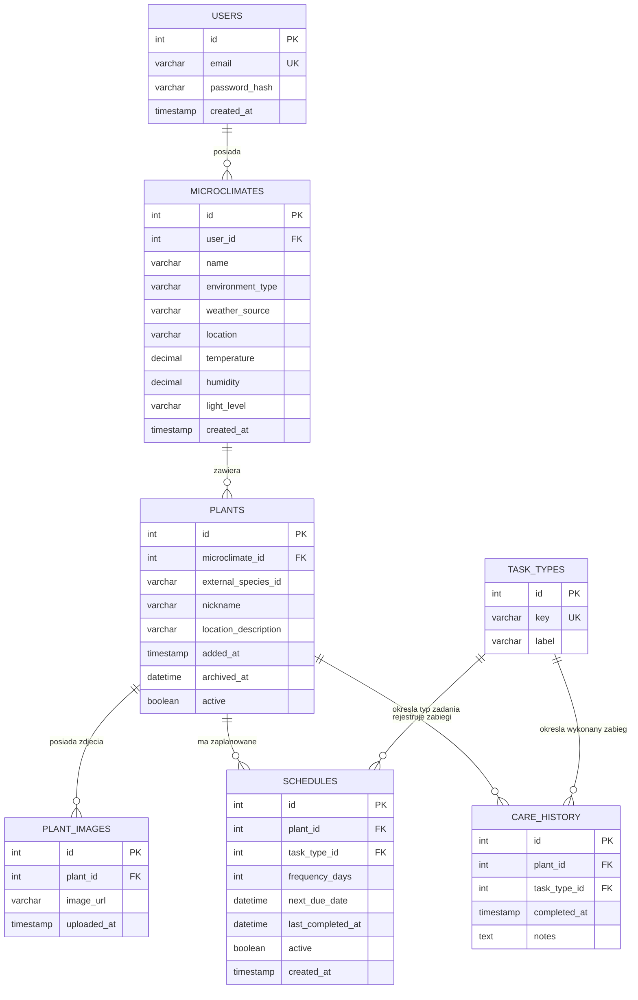

# 🌱 Greenly Backend – Virtual Garden API

Kompletny, produkcyjny backend dla aplikacji **Greenly** (wirtualny ogród i inteligentny asystent pielęgnacji roślin) zbudowany przy użyciu **Node.js**, **Express.js**, **Drizzle ORM** oraz bazy danych **MySQL / MariaDB**.

System realizuje zarządzanie mikroklimatami, kolekcją roślin, automatycznymi harmonogramami zabiegów pielęgnacyjnych, historią wykonanych prac oraz modułem automatyzacji pogodowej opartym o **CRON**, który dynamicznie dostosowuje harmonogram podlewania roślin zewnętrznych (`Outdoor`) w oparciu o warunki atmosferyczne i symuluje wysyłanie powiadomień PUSH.

---

## 🛠️ Stos Technologiczny

- **Środowisko:** Node.js (v20+)
- **Framework HTTP:** Express.js 4 / 5
- **ORM & Migracje:** Drizzle ORM + Drizzle Kit
- **Baza danych:** MySQL / MariaDB (poprzez sterownik `mysql2/promise`)
- **Bezpieczeństwo & Autoryzacja:** JSON Web Tokens (`jsonwebtoken`), hashowanie haseł `bcrypt`
- **Zadania w tle (Scheduler):** `node-cron`
- **Klient HTTP:** `axios`
- **Format modułów:** ECMAScript Modules (`"type": "module"`)

---

## 📐 Architektura Bazy Danych (ERD)

Schemat bazy danych został zaprojektowany zgodnie ze specyfikacją wymagań i definicjami relacji w Drizzle ORM:



### Reguły integralności danych:
- Wszystkie klucze obce posiadają regułę `ON DELETE CASCADE`. Usunięcie mikroklimatu kaskadowo usuwa powiązane z nim rośliny, ich zdjęcia, harmonogramy i wpisy w historii pielęgnacji.
- Rośliny wspierają bezpieczną archiwizację (*soft-delete*) poprzez flagę `active = false` i ustawienie znacznika czasu `archived_at`.

---

## 🚀 Szybki Start

### 1. Wymagania wstępne
- Zainstalowane środowisko **Node.js** (rekomendowana wersja >= 20.x lub 22.x)
- Uruchomiona instancja **MySQL** lub **MariaDB** (np. lokalny XAMPP na porcie 3306)
- Utworzona baza danych o nazwie `greenly`:
  ```sql
  CREATE DATABASE IF NOT EXISTS greenly CHARACTER SET utf8mb4 COLLATE utf8mb4_unicode_ci;
  ```

### 2. Konfiguracja zmiennych środowiskowych
Utwórz lub zweryfikuj plik `.env` w katalogu głównym projektu:

```env
PORT=3000
DATABASE_URL=mysql://root:@localhost:3306/greenly
JWT_SECRET=supersecretgreenlyjwtkey_2026
JWT_EXPIRES_IN=7d
NODE_ENV=development
```

### 3. Instalacja zależności
```bash
npm install
```

### 4. Synchronizacja schematu bazy danych (Drizzle ORM)
Aplikuj schemat bezpośrednio do bazy danych:
```bash
npm run db:push
```

### 5. Inicjalizacja słowników i konta demo (Seed)
Wypełnij bazę podstawowymi typami zabiegów (`water`, `fertilize`, `repot`, `prune`) oraz kontem demo:
```bash
npm run db:seed
```

### 6. Uruchomienie aplikacji
- Tryb produkcyjny:
  ```bash
  npm start
  ```
- Tryb deweloperski (z automatycznym przeładowaniem):
  ```bash
  npm run dev
  ```

Serwer domyślnie nasłuchuje pod adresem: `http://localhost:3000`.

---

## 📖 Dokumentacja API (Endpointy)

Wszystkie trasy chronione wymagają nagłówka HTTP:
`Authorization: Bearer <TOKEN_JWT>`

### 1. Uwierzytelnianie (`/api/auth`)

| Metoda | Endpoint | Wymaga Auth | Opis |
|---|---|:---:|---|
| `POST` | `/api/auth/register` | Nie | Rejestracja nowego użytkownika (`email`, `password`) |
| `POST` | `/api/auth/login` | Nie | Logowanie i generowanie tokena JWT |
| `GET` | `/api/auth/me` | **Tak** | Pobranie profilu zalogowanego użytkownika |

#### Przykład rejestracji (`POST /api/auth/register`):
```json
// Request Body:
{
  "email": "jan.kowalski@example.com",
  "password": "mojeSekretneHaslo123"
}

// Response (201 Created):
{
  "message": "Użytkownik zarejestrowany pomyślnie",
  "token": "eyJhbGciOiJIUzI1NiIsInR5cCI6IkpXVCJ9...",
  "user": {
    "id": 1,
    "email": "jan.kowalski@example.com"
  }
}
```

---

### 2. Mikroklimaty (`/api/microclimates`)

| Metoda | Endpoint | Wymaga Auth | Opis |
|---|---|:---:|---|
| `GET` | `/api/microclimates` | **Tak** | Lista mikroklimatów użytkownika |
| `GET` | `/api/microclimates/:id` | **Tak** | Szczegóły wybranego mikroklimatu |
| `POST` | `/api/microclimates` | **Tak** | Utworzenie nowego mikroklimatu |
| `PUT` / `PATCH` | `/api/microclimates/:id` | **Tak** | Aktualizacja parametrów mikroklimatu |
| `DELETE` | `/api/microclimates/:id` | **Tak** | Usunięcie mikroklimatu (kaskadowe) |

#### Przykład utworzenia mikroklimatu (`POST /api/microclimates`):
```json
// Request Body:
{
  "name": "Balkon Południowy",
  "environmentType": "Outdoor",
  "weatherSource": "open-meteo",
  "location": "Warszawa",
  "temperature": 22.5,
  "humidity": 55.0,
  "lightLevel": "high"
}
```

---

### 3. Rośliny (`/api/plants`)

| Metoda | Endpoint | Wymaga Auth | Opis |
|---|---|:---:|---|
| `GET` | `/api/plants` | **Tak** | Pobranie roślin użytkownika (wzbogaconych o mikroklimat, zdjęcia i aktywne harmonogramy) |
| `GET` | `/api/plants/:id` | **Tak** | Szczegóły rośliny wraz z pełną historią pielęgnacji |
| `POST` | `/api/plants` | **Tak** | Dodanie rośliny, opcjonalnego zdjęcia oraz automatyczne utworzenie harmonogramu podlewania |
| `PUT` / `PATCH` | `/api/plants/:id` | **Tak** | Aktualizacja danych rośliny |
| `DELETE` | `/api/plants/:id` | **Tak** | Archiwizacja rośliny (*soft-delete*) lub usunięcie trwałe (`?permanent=true`) |

#### Przykład dodania rośliny (`POST /api/plants`):
```json
// Request Body:
{
  "microclimateId": 1,
  "nickname": "Monstera Deliciosa",
  "externalSpeciesId": "monstera-deliciosa",
  "locationDescription": "Róg salonu przy oknie",
  "frequencyDays": 7,
  "imageUrl": "https://images.unsplash.com/photo-1614594975525-e45190c55d0b"
}
```

---

### 4. Pielęgnacja i Harmonogramy (`/api/care`)

Logika modułu pielęgnacji zapewnia pełną automatyzację: zarejestrowanie wykonanej czynności nie tylko tworzy wpis w `care_history`, ale również odnajduje odpowiedni wpis w tabeli `schedules`, aktualizuje datę `last_completed_at` oraz wylicza nowy termin `next_due_date` na podstawie `frequency_days`.

| Metoda | Endpoint | Wymaga Auth | Opis |
|---|---|:---:|---|
| `GET` | `/api/care/task-types` | **Tak** | Lista typów zabiegów (`water`, `fertilize`, `repot`, `prune`) |
| `POST` | `/api/care/plants/:plantId` | **Tak** | Zalogowanie czynności pielęgnacyjnej i przeliczenie harmonogramu |
| `GET` | `/api/care/plants/:plantId` | **Tak** | Pobranie historii zabiegów pielęgnacyjnych rośliny |

*Uwaga: Dostępne są także aliasy pod `/api/plants/:plantId/care-actions` oraz `/api/plants/:plantId/care-history`.*

#### Przykład rejestracji zabiegu (`POST /api/care/plants/1`):
```json
// Request Body:
{
  "taskTypeKey": "water",
  "notes": "Podlano 300 ml wody z nawozem biohumus"
}

// Response (201 Created):
{
  "message": "Czynność pielęgnacyjna została pomyślnie zarejestrowana",
  "careAction": {
    "id": 1,
    "plantId": 1,
    "taskTypeId": 1,
    "completedAt": "2026-09-20T17:20:13.000Z",
    "notes": "Podlano 300 ml wody z nawozem biohumus",
    "taskType": {
      "id": 1,
      "key": "water",
      "label": "Podlewanie"
    }
  },
  "updatedSchedule": {
    "id": 1,
    "plantId": 1,
    "taskTypeId": 1,
    "frequencyDays": 7,
    "nextDueDate": "2026-09-27T17:20:13.000Z",
    "lastCompletedAt": "2026-09-20T17:20:13.000Z",
    "active": true
  }
}
```

---

### 5. Moduł Automatyzacji i Pogody (CRON)

W pliku [**`src/services/cronService.js`**](file:///D:/Greenly/greenly-backend/src/services/cronService.js) zaimplementowano zadanie uruchamiane codziennie o godzinie **08:00 rano** (`0 8 * * *`):

1. Pobiera wszystkie aktywne rośliny przypisane do mikroklimatów oznaczonych jako `Outdoor` (na zewnątrz).
2. Pobiera dane meteorologiczne (opady, temperatura) dla lokalizacji mikroklimatu.
3. **Inteligentna korekta harmonogramu:**
   - **W przypadku opadów deszczu:** gleba została naturalnie nawodniona, więc termin kolejnego podlewania w tabeli `schedules` jest automatycznie **przesuwany o 2 dni do przodu**.
   - **W przypadku wysokich upałów (>= 28°C):** gleba wysycha szybciej, więc termin kolejnego podlewania jest **przyspieszany o 1 dzień**.
4. W konsoli generowany jest sformatowany komunikat powiadomienia **PUSH**:

```text
================== [POWIADOMIENIE PUSH] ==================
Do użytkownika: jan.kowalski@example.com (ID: 1)
Dotyczy rośliny: "Bazylia Balkonowa" (Lokalizacja: Balkon Południowy)
Komunikat: Automatyczna korekta harmonogramu! Wykryto opady deszczu (8.2 mm). Przesunięto termin podlewania o 2 dni do przodu.
Poprzedni termin: 23.09.2026
Nowy termin:      25.09.2026
==========================================================
```

#### Ręczne wywołanie diagnostyczne:
Dla celów testowych oraz prezentacyjnych dostępny jest dedykowany endpoint:
`POST http://localhost:3000/api/cron/trigger-weather`

---

## 🧪 Testy Integracyjne

W projekcie znajduje się skrypt [**`test-api.js`**](file:///D:/Greenly/greenly-backend/test-api.js) testujący kompleksowo wszystkie scenariusze biznesowe (rejestrację, logowanie, JWT, mikroklimaty, rośliny, automatyczne harmonogramy, historię pielęgnacji, CRON oraz usuwanie).

Aby uruchomić testy integracyjne:
```bash
node test-api.js
```

Oczekiwany rezultat:
```text
🚀 Rozpoczynam kompleksowy test API Greenly...
✅ 1. Healthcheck
✅ 2. Rejestracja użytkownika
✅ 3. Logowanie użytkownika
✅ 4. Autoryzacja i profil użytkownika
✅ 5. Utworzenie mikroklimatu
✅ 6. Pobranie mikroklimatów
✅ 7. Dodanie rośliny i wygenerowanie harmonogramu
✅ 8. Szczegóły rośliny pobrane z relacjami
✅ 9. Logowanie czynności pielęgnacyjnej i przeliczenie terminu
✅ 10. Historia pielęgnacji rośliny
✅ 11. Wywołanie zadania pogodowego CRON
✅ 12. Aktualizacja rośliny
✅ 13. Usunięcie / archiwizacja rośliny
🎉 Wszystkie testy integracyjne zakończone 100% SUKCESEM!
```

Dodatkowo w repozytorium znajduje się plik [**`requests.http`**](file:///D:/Greenly/greenly-backend/requests.http) umożliwiający bezpośrednie testowanie zapytań w rozszerzeniu *REST Client* w Visual Studio Code lub IntelliJ IDEA.
